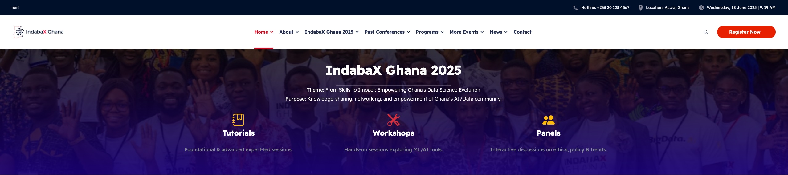

<!-- ─────────────────────────────  IndabaX banner  ──────────────────────────── -->
<p align="center">
  
</p>

# Ghana Data Science Summit — IndabaX 2025
**Dates:** 18 – 20 June 2025 | **Venue:** Ashesi University, Berekuso, Ghana  

A three-day, hands-on gathering focused on Data Science, Machine Learning & AI.  
This repository hosts all notebooks, datasets and slide decks for the tutorial tracks.

---

## What’s in this repo?
Each tutorial has its own folder containing Jupyter notebooks, data, and slides.
Below is a detailed breakdown of each tutorial, dates, and the assigned facilitator / co-facilitator, along with their email addresses.

<p align="center">
  
</p>

_Open any folder to dive straight into its materials; most include a mini-README with extra setup notes._

---

## Pre-conference preparation
We **strongly** recommend you complete the short prep guide before Day 1:  
<https://docs.google.com/document/d/e/2PACX-1vQrZPAraR6HuTrSzeWUqxGFKAUGCnPk8r1gQTJJSSmUaiBsJcowdgW4HTPlJ2fGamoZODb8-l_Yz740/pub>

That page covers everything you need to get the most out of each tutorial.

---

## Quick-start checklist

1. **Clone the repo**

   ```bash
   git clone https://github.com/<your-org>/IndabaX25.git
   cd IndabaX25

2. Create & activate an environment

    ```bash
    python -m venv indabax25_env            # or: conda create -n indabax25 python=3.10
    source indabax25_env/bin/activate       # Windows: indabax25_env\Scripts\activate
    ```


## License  
This work is licensed under a  
[Creative Commons Attribution-NonCommercial 4.0 International License (CC BY-NC 4.0)](https://creativecommons.org/licenses/by-nc/4.0/).

You are free to **share** and **adapt** the material for non-commercial purposes, provided you give appropriate credit and indicate any changes. The full legal text is included in the `LICENSE` file at the root of this repository.

<p align="center">
  <b>See you at Ashesi University on 18 June 2025! ✨<br>
  — The IndabaX Ghana organising team</b>
</p>


